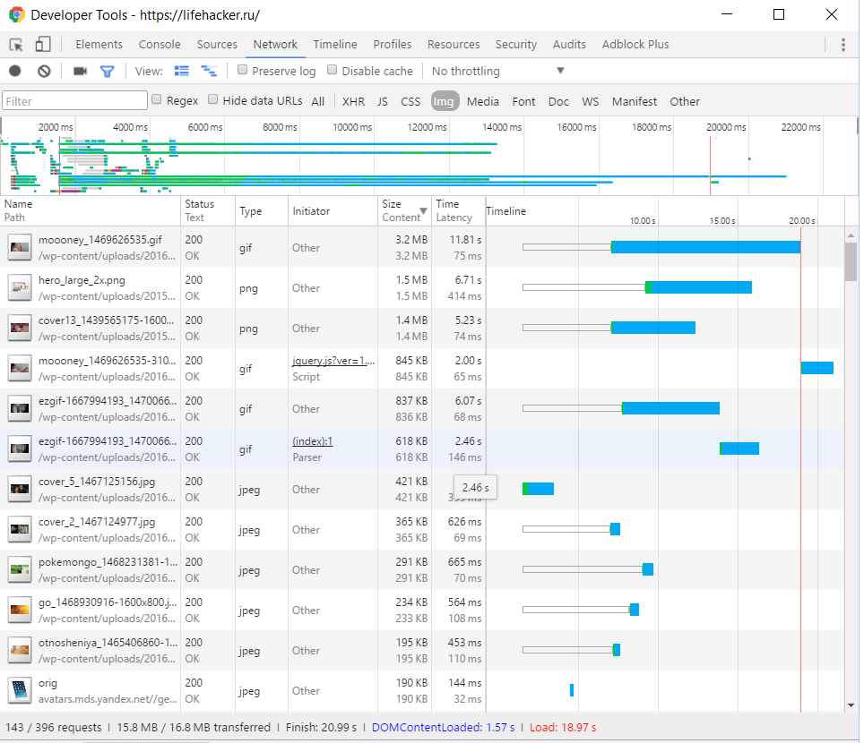
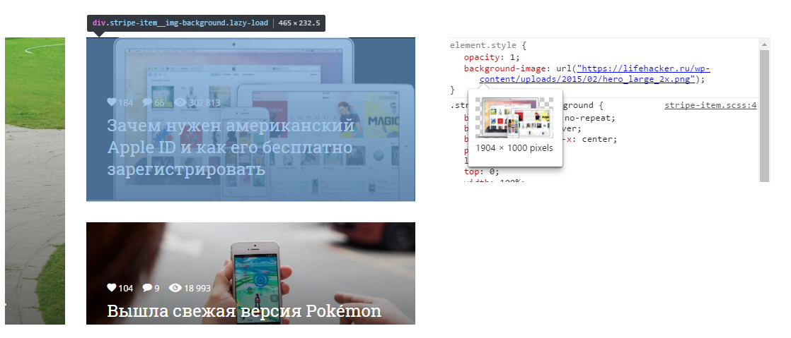
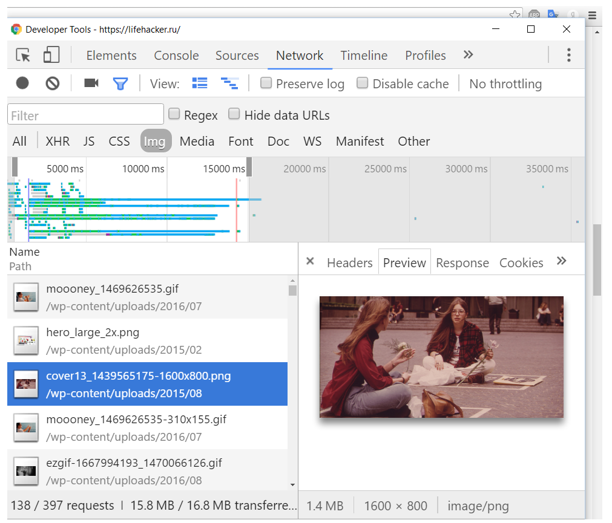
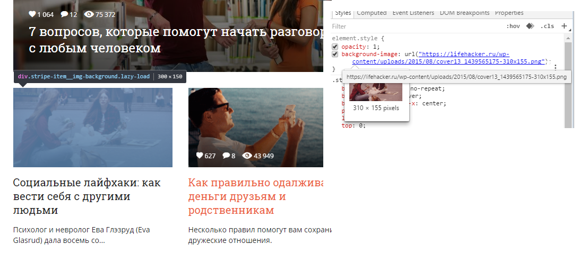
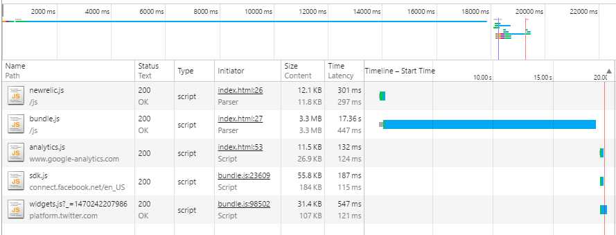

# Lifehacker

## Большой объем сайта

Объем сайта варьируется от 15 до 20 мб, в зависимости от контента, и даже с хорошей скоростью интернета это много.

Изображения занимают большую часть передаваемого контента (15.0 / 16.8 MB), поэтому оптимизировав их, можно сразу получить существенный выигрыш.

На главной странице показаны главные новости, они представляют собой прямоугольники с изображениями.
Изображения адаптированы под разные разрешения, но большинство из них большего разрешения, чем их размер при отображении на сайте.

Отсортируем изображения по размеру:

Больше всего весит gif с анимацией (3.2 мб), ее можно заменить на обычную картинку.

Рассмотрим второе по размеру изображение (1.5 мб):

Его разрешение сильно превосходит его размер на экране.

Рассмотрим третье изображение (1.4 мб):

---

Его блок имеет размер 300 x 150 px, однако, оно даже не используется. Вместо него загружается еще одно, такое же, но правильного размера (310 x 155 px). То есть, загружается лишний контент.

Если посчитать, то первые 7 самых тяжелых изображений занимают 8.8 мб, что больше половины объема всего сайта. Поэтому в целом, разрешение большинства изображений оптимизировано, но оставшиеся увеличивают объем сайта в разы.

## Не используется сжатие изображений.

Можно использовать HTML5 элемент picture, и использовать webp формат для девайсов, которые его поддерживают. Самое тяжелое изображение сжалось с webp до 158 кб в исходном разрешении (1904 x 1000 px), без заметной потери качества. Для неподдерживающих webp девайсов можно сжать png.

## Много запросов к API социальных сетей

При загрузке главной страницы для каждой статьи делаются запросы к социальным сетям о количестве лайков и комментариев. Для каждого запроса к VK и Facebook загружается небольшой js файл. Из-за того, что запросов очень много, они выполняются последовательно и это занимает много времени. Эти данные можно собирать на сарвере несколько раз в минуту и присылать клиенту в одном JSON объекте для всех статей сразу. Можно сделать исключение, когда пользователь заходит на отдельную статью, чтобы если он ее сам лайкнул, счетчик обновился.

## Скрипты в head

При включенном js первая прорисовка происходит через 1,3с после запроса (при очищенном кэшэ), а без js - через 0.7с. Тот же эффект должен получиться, если переместить все скрипты из head в конец body.

## Шрифты блокируют отображение текста

Иконки со статьями на главной странице появляются намного раньше, чем текст на них. До загрузки шрифтов стоит использовать один из стандартных, чтобы пользователь мог начать искать интересную статью сразу. Если потом подменить шрифты, то это не должно сдвинуть контент и помешать чтению, так как размеры блоков на главной странице сайта не зависят от текста.

## Много неиспользуемых стилей

Посмотрев DevTools audits я обнаружил, что почти все css файлы не применяются полностью или частично. 11 файлов не используется вообще (видимо, грузятся для других страниц), но загружаются в head. Самый большой css файл со стилями bootstrap используется на 6%. Можно было бы создать набор из основных стилей для главной страницы и подгружать остальные после первой прорисовки.

## Много файлов

Всего отдельно загружается около 130 js файлов. Часть из них для запросов к api VK и Facebook (пункт выше), остальные, около 30 -- для поддержания функциональности сайта, их стоит по возможности собрать в один файл.

-------------

## Второй сайт: arena.topcoder.com

После авторизации сайт загружается первый раз (или если очистить кэш) около 20 секунд с хорошим интернетом.

Кроме медленного соединения с сервером, оказалось, что первые 18 секунд грузится один файл bundle.js, который весит 3.3 мб:

Затем на его выполнение тратится около 0.5с, и еще около 0.5с грузятся остальные файлы.

## Файл не миницифирован и не сжат с помощью gzip

Значительная часть состоит из комментариев, после минификации с помощью uglify размер составил 1.15 мб, а минифицированный и сжатый, файл стал весить 339 кб.

Несмотря на то, что сайт одностраничный, возможно, стоило разбить код js на несколько частей и подгружать по мере необходимости.

Так же, как и на лайфхакере, пользовательский шрифт блокирует отображение текста.

Скрипты в head, но так как весь видимый контент грузится через них, не имеет большого значения.